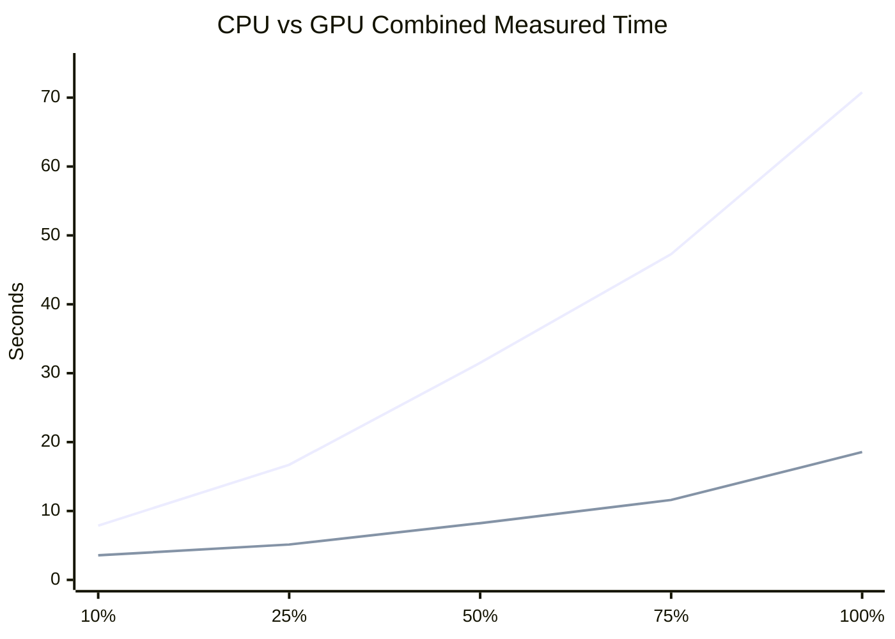
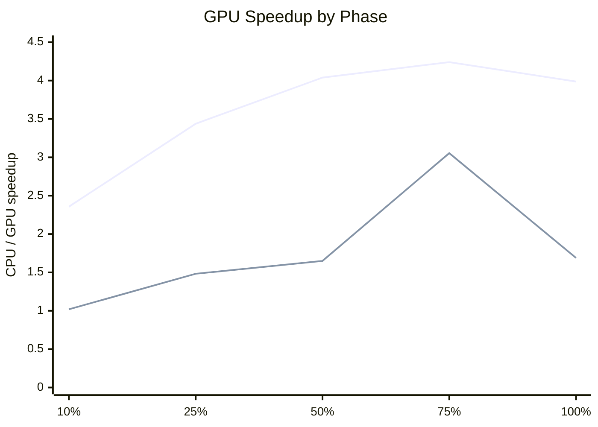

# CPU vs GPU Performance Analysis

Working analysis for the performance-analysis pages of the final report. All numbers below are taken from the saved outputs in [complaints_assignment_cpu.ipynb](../ml_project_edit/complaints_assignment_cpu.ipynb) and [complaints_assignment_gpu.ipynb](../ml_project_edit/complaints_assignment_gpu.ipynb). Runtime and hardware metadata have now been filled from the execution environments used for the saved runs.

## 1. Problem Description

This project predicts whether a consumer disputed a complaint using a structured-feature XGBoost classification pipeline built from the CFPB complaints dataset. The goal of the GPU port is not to change the modeling task, but to execute the same predictive workflow on GPU-capable tooling and then compare performance in a structured way, as required by `proj1.pdf`.

The saved notebook outputs show the following full-scale data footprint after cleaning and feature preparation:

- Training rows after cleaning: `321,430`
- External inference rows: `100`
- Validation rows at full scale: `64,286`
- Encoded feature count: `3,375`
- Dataset-size sweep used in both notebooks: `10%, 25%, 50%, 75%, 100%`
- Benchmark repeats used in both notebooks: `3`

The CPU notebook acts as the baseline implementation and the GPU notebook mirrors the same logic closely enough to support a fair comparison.

## 2. Solution Design

The two notebooks are aligned around the same core workflow:

- Same target: `Consumer disputed?`
- Same structured feature set and one-hot encoding strategy
- Same subset fractions
- Same deterministic split logic and random seed
- Same evaluation threshold (`0.50`)
- Same XGBoost hyperparameters, except `device='cpu'` vs `device='cuda'`

At full scale, the saved artifact summaries show exact agreement on the structural comparison checks:

| Check | CPU | GPU |
| --- | ---: | ---: |
| Train rows after cleaning | 321,430 | 321,430 |
| Inference rows after cleaning | 100 | 100 |
| Encoded feature count | 3,375 | 3,375 |
| Validation prediction length | 64,286 | 64,286 |
| Inference prediction length | 100 | 100 |

The full-scale predictive metrics are also very close:

| Metric | CPU | GPU | Delta (GPU - CPU) |
| --- | ---: | ---: | ---: |
| Accuracy | 0.564000 | 0.564353 | +0.000353 |
| Precision | 0.267700 | 0.267342 | -0.000358 |
| Recall | 0.685900 | 0.682631 | -0.003269 |
| F1 | 0.385100 | 0.384213 | -0.000887 |

Across the full five-point sweep, the maximum absolute metric differences remain small:

- Accuracy: `0.0047`
- Precision: `0.0054`
- Recall: `0.0117`
- F1: `0.0074`

That is strong evidence that the GPU notebook is a substantively equivalent implementation of the CPU baseline, which satisfies the assignment requirement that the two versions remain comparable.

## 3. Experimental Setup

The saved notebook outputs support the following experimental protocol:

- Dataset-size sweep: `10%, 25%, 50%, 75%, 100%`
- Repeats per benchmark point: `3`
- Timed phases:
  - model training (`fit`)
  - validation inference (`predict_proba` on the validation split)
  - external inference (`predict_proba` on the 100-row inference file subset)
- Timing method: wall-clock timing recorded inside each notebook
- GPU timing includes explicit synchronization before and after timed calls

Important scope note: the timed benchmark phases do **not** include the full end-to-end pipeline. Dataset preparation, feature encoding, and split construction happen outside the timed blocks. The measured results therefore describe **model execution performance**, not total pipeline runtime from raw CSV to final output.

The per-fraction inference subsets are tiny because the external inference file only contains 100 rows. That means the inference row counts are:

| Fraction | Inference rows |
| --- | ---: |
| 10% | 10 |
| 25% | 25 |
| 50% | 50 |
| 75% | 75 |
| 100% | 100 |

## 4. Results

Headline result: the GPU version delivers clear performance gains for the measured workload, mainly by accelerating model training. At full scale, the combined measured workload drops from `70.7750s` on CPU to `18.5536s` on GPU, which is a `3.81x` speedup.

### Combined Measured Time Plot

The chart below compares the total measured workload at each dataset size, where total measured time is:

`training + validation inference + external inference`

Fallback numeric values for the chart:

| Fraction | CPU total measured time (s) | GPU total measured time (s) | Combined speedup |
| --- | ---: | ---: | ---: |
| 10% | 7.8822 | 3.5634 | 2.2120x |
| 25% | 16.7083 | 5.1354 | 3.2536x |
| 50% | 31.5068 | 8.2307 | 3.8280x |
| 75% | 47.2795 | 11.6053 | 4.0740x |
| 100% | 70.7750 | 18.5536 | 3.8146x |

### CPU Benchmark Results

| Fraction | Train rows | Validation rows | Inference rows | Train time (mean +- std) | Validation time (mean +- std) | External inference time (mean +- std) | Accuracy | F1 |
| --- | ---: | ---: | ---: | ---: | ---: | ---: | ---: | ---: |
| 10% | 32,143 | 6,429 | 10 | 7.5436 +- 0.0222 | 0.1750 +- 0.0011 | 0.1636 +- 0.0512 | 0.5923 | 0.3524 |
| 25% | 80,358 | 16,072 | 25 | 16.1709 +- 0.3687 | 0.3748 +- 0.0504 | 0.1626 +- 0.0216 | 0.5735 | 0.3739 |
| 50% | 160,715 | 32,143 | 50 | 30.7553 +- 1.1462 | 0.5420 +- 0.0320 | 0.2095 +- 0.0443 | 0.5658 | 0.3815 |
| 75% | 241,072 | 48,214 | 75 | 46.2221 +- 1.4436 | 0.8463 +- 0.0418 | 0.2111 +- 0.0486 | 0.5629 | 0.3859 |
| 100% | 321,430 | 64,286 | 100 | 69.2820 +- 2.8952 | 1.2309 +- 0.0539 | 0.2621 +- 0.0837 | 0.5640 | 0.3851 |

### GPU Benchmark Results

| Fraction | Train rows | Validation rows | Inference rows | Train time (mean +- std) | Validation time (mean +- std) | External inference time (mean +- std) | Accuracy | F1 |
| --- | ---: | ---: | ---: | ---: | ---: | ---: | ---: | ---: |
| 10% | 32,143 | 6,429 | 10 | 3.2009 +- 0.3171 | 0.1717 +- 0.0197 | 0.1908 +- 0.0973 | 0.5970 | 0.3598 |
| 25% | 80,358 | 16,072 | 25 | 4.7043 +- 0.0907 | 0.2528 +- 0.0946 | 0.1783 +- 0.0126 | 0.5729 | 0.3754 |
| 50% | 160,715 | 32,143 | 50 | 7.6148 +- 0.1740 | 0.3286 +- 0.0947 | 0.2873 +- 0.0918 | 0.5698 | 0.3816 |
| 75% | 241,072 | 48,214 | 75 | 10.8998 +- 0.0262 | 0.2771 +- 0.0115 | 0.4284 +- 0.0157 | 0.5630 | 0.3863 |
| 100% | 321,430 | 64,286 | 100 | 17.3749 +- 3.1617 | 0.7288 +- 0.0603 | 0.4499 +- 0.1565 | 0.5645 | 0.3845 |

### Derived Comparison Table

| Fraction | CPU total (s) | GPU total (s) | Training speedup | Validation speedup | External inference speedup | Combined speedup | Notes |
| --- | ---: | ---: | ---: | ---: | ---: | ---: | --- |
| 10% | 7.8822 | 3.5634 | 2.3567x | 1.0192x | 0.8574x | 2.2120x | GPU already faster overall, but tiny inference batch is still CPU-favored. |
| 25% | 16.7083 | 5.1354 | 3.4375x | 1.4826x | 0.9119x | 3.2536x | Training gains dominate the total improvement. |
| 50% | 31.5068 | 8.2307 | 4.0389x | 1.6494x | 0.7292x | 3.8280x | Mid-scale run shows strong training acceleration and near-identical F1. |
| 75% | 47.2795 | 11.6053 | 4.2406x | 3.0541x | 0.4928x | 4.0740x | Best combined speedup in the saved results. |
| 100% | 70.7750 | 18.5536 | 3.9875x | 1.6889x | 0.5826x | 3.8146x | Full-scale benchmark still shows a large overall GPU advantage. |

## 5. Training vs. Inference Breakdown

Training is the main driver of the GPU gain. In the saved results:

- Training speedup ranges from `2.36x` to `4.24x`, with an average of about `3.61x`
- Validation speedup ranges from `1.02x` to `3.05x`, with an average of about `1.78x`
- External inference is slower on GPU at every scale, with speedup below `1.0x` throughout
- Combined measured workload speedup ranges from `2.21x` to `4.07x`, with an average of about `3.44x`

Phase-level speedup plot:

Training also dominates the total measured time share in both notebooks:

- CPU training share of total measured time: `95.7%` to `97.9%`
- GPU training share of total measured time: `89.8%` to `93.9%`

This explains why training speedup translates so directly into overall speedup, even though the GPU never wins on the small external inference batch.

## 6. Discussion

The saved outputs support four main conclusions.

First, the GPU implementation provides clear value for model training at every tested dataset size. Even the smallest measured workload (`10%`) shows a training speedup above `2.3x`, and the middle-to-large scales approach or exceed `4x`.

Second, validation inference benefits from GPU execution overall, but less consistently than training. Validation batches are much larger than the external inference batches, so GPU setup cost is more easily amortized, especially at `50%-100%` scale.

Third, external inference remains CPU-favored because the inference file is extremely small. The GPU notebook is predicting only `10` to `100` rows in that phase, which is exactly the regime where launch overhead, memory movement, and setup cost can dominate the useful work. This is the clearest example of the assignment's point that GPU acceleration does not automatically improve every workload.

Fourth, the measured benchmark is narrower than a full end-to-end pipeline benchmark. The notebooks time `fit` and `predict_proba`, but they do not time the full preprocessing and feature-encoding path. That matters when interpreting the results: the saved numbers show strong GPU acceleration for model execution, but they should not be presented as full raw-CSV-to-output speedups.

One additional implementation note is visible in the CPU notebook output: repeated pandas `PerformanceWarning` messages appear during the benchmark run because the CPU alignment step inserts columns repeatedly into a fragmented DataFrame. That likely adds some avoidable overhead to the CPU baseline. It is worth noting as a limitation, but it does not change the overall conclusion because the GPU training advantage is large and persistent across all saved scales.

## 7. Reproducibility Notes

The following artifacts are sufficient to reproduce the recorded comparison workflow:

- `ml_project_edit/complaints_assignment_cpu.ipynb`
- `ml_project_edit/complaints_assignment_gpu.ipynb`
- `ml_project_edit/complaints_training.csv`
- `ml_project_edit/complaints_inference.csv`

Important reproducibility notes:

- This analysis uses the **saved notebook outputs** as the source of truth.
- The notebooks use the same dataset fractions, random seed, threshold, and model structure to keep CPU and GPU runs comparable.
- The CPU results were generated locally in VS Code's Jupyter front-end using the `ml_lab` environment at `C:\Users\conno\dev\envs\ml_lab\python.exe`.
- The GPU results were generated in a WSL2 RAPIDS environment on Ubuntu 24.04.4 LTS.

## 8. Conclusion

The GPU notebook is a substantively equivalent implementation of the CPU baseline and delivers meaningful performance gains for the measured workload. The strongest benefit appears in model training, where the GPU provides multi-x acceleration across the entire dataset-size sweep. Validation inference also benefits overall, but small external inference batches remain faster on CPU because GPU overhead is not amortized.

For this project, the GPU version is preferable when training on medium-to-large data subsets or when repeated model fitting is part of the workflow. The CPU version remains sufficient for very small-batch inference or for environments where GPU setup complexity is not justified.

## 9. Missing Runtime Details

Fill these placeholders when the run specs are available:

- CPU environment:
  - Processor: `Intel Core Ultra 9 275HX`
  - Core / thread count: `24 cores / 24 logical processors`
  - RAM: `33.75 GB physical RAM`
  - Operating system: `Windows 11 Home 64-bit, build 10.0.26200`
  - Execution environment: `VS Code local Jupyter kernel using C:\Users\conno\dev\envs\ml_lab\python.exe`
- GPU environment:
  - GPU model: `NVIDIA GeForce RTX 5080 Laptop GPU`
  - VRAM: `16303 MiB`
  - Host environment: `Ubuntu 24.04.4 LTS on WSL2`
- Software versions:
  - CPU notebook: `Python 3.13.12`, `XGBoost 3.2.0`
  - GPU notebook: `Python 3.13.13`, `XGBoost 3.2.0`, `cuDF 26.04.00`, `CuPy 14.0.1`, `cuML 26.04.00`, `CUDA 13.1`

The main remaining non-runtime submission placeholders are the student names in the report header and, if the course expects exact AI model naming, the precise platform-side Codex model label.
